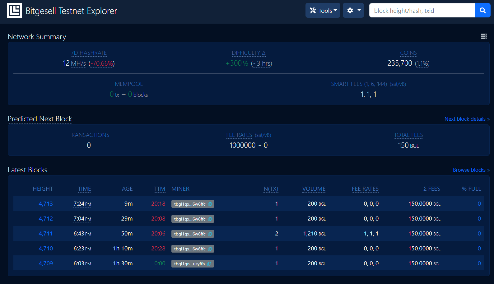

# BGL Testnet RPC Explorer

## Self-Hosted Bitgesell explorer for everyone running [Bitgesell Core](https://github.com/BitgesellOfficial).

---

This is a self-hosted explorer for the Bitgesell blockchain, driven by RPC calls to your own [Bitgesell](https://github.com/BitgesellOfficial) node. It is easy to run and can be connected to other tools (like Electrum servers) to achieve a full-featured explorer.

Whatever reasons you may have for running a full node (trustlessness, technical curiosity, supporting the network, etc) it's valuable to appreciate the *fullness* of your node. With this explorer, you can explore not just the blockchain database, but also explore all of the functional capabilities of your own node.

Live demos: [testnet.bglnode.online](https://testnet.bglnode.online)

# Features

* Network Summary dashboard
* View details of blocks, transactions, and addresses
* Analysis tools for viewing stats on blocks, transactions, and miner activity
* See raw JSON content from bitcoind used to generate most pages
* Search by transaction ID, block hash/height, and address
* Optional transaction history for addresses by querying from Electrum-protocol servers (e.g. Electrs, ElectrumX), blockchain.com, blockchair.com, or blockcypher.com
* Mempool summary, with fee, size, and age breakdowns
* RPC command browser and terminal

# Changelog / Release notes

See [CHANGELOG.md](/CHANGELOG.md).

# Getting started

## Prerequisites

1. Install `Bitgesell Core` - [instructions](https://bglcontest.bitaps.com/node_setup). 

Ensure that `Bitgesell Core`'s' RPC server is enabled (`server=1`) and using the testnet chain (`testnet=1`).
 
 1.1. Past to BGL.conf file these lines to sync with the testnet:

`[test]`

`addnode=164.132.216.62`

`addnode=164.132.216.61`

`addnode=164.132.216.58`

`minimumchainwork=0x000000000000000000000000000000000000000000000000000000000000000ff`

2. Allow `Bitgesell Core` to synchronize with the Bitgesell test network (you *can* use this tool while sychronizing, but some pages may fail).
3. Install Node.js (12.9+ required, 16+ recommended).

### Note about pruning and indexing configurations

This tool is designed to work best with full transaction indexing enabled (`txindex=1`) and pruning **disabled**. 
However, you can run *without* `txindex` enabled and/or *with* `pruning` enabled and this tool will continue to function, but some data will be incomplete or missing. Also note that such Bitgesell Core configurations receive less thorough testing.

In particular, with `pruning` enabled and/or `txindex` disabled, the following functionality is altered:

* You will only be able to search for mempool, recently confirmed, and wallet transactions by their txid. Searching for non-wallet transactions that were confirmed over 3 blocks ago is only possible if you provide the confirmed block height in addition to the txid.
* Pruned blocks will display basic header information, without the list of transactions. Transactions in pruned blocks will not be available, unless they're wallet-related. Block stats will only work for unpruned blocks.
* The address and amount of previous transaction outputs will not be shown, only the txid:vout.
* The mining fee will only be available for unconfirmed transactions.

## Install / Run

If you're running on testnet with the default datadir and port, the default configuration should *Just Work*. Otherwise, see the **Configuration** section below.

#### Run from source or try example on [CodeSandbox](https://codesandbox.io/s/amazing-dawn-mbdcmw):

1. `git clone https://github.com/alekcangp/bgl-rpc-explorer`
2. `cd bgl-rpc-explorer`
3. `npm install`
4. `npm start`

After a default installation+startup using any of the above methods, the app can be viewed at [http://127.0.0.1:3002/](http://127.0.0.1:3002/)

## Configuration

Configuration options may be set via environment variables or CLI arguments.

#### Configuration with environment variables

To configure with environment variables, you need to create file and enter values in it:

`.env` in the working directory for bgl-rpc-explorer

In either case, refer to [.env-sample](.env-sample) for a list of the options and formatting details.

#### SSO authentication

You can configure SSO authentication similar to what ThunderHub and RTL provide.
To enable it, make sure `BTCEXP_BASIC_AUTH_PASSWORD` is **not** set and set `BTCEXP_SSO_TOKEN_FILE` to point to a file write-accessible by btc-rpc-explorer.
Then to access btc-rpc-explorer, your SSO provider needs to read the token from this file and set it in URL parameter `token`.
For security reasons the token changes with each login, so the SSO provider needs to read it each time!

After successful access with the token, a cookie is set for authentication, so you don't need to worry about it anymore.
To improve user experience you can set `BTCEXP_SSO_LOGIN_REDIRECT_URL` to the URL of your SSO provider.
This will cause users to be redirected to your login page if needed.

## Reverse proxy with HTTPS

See [instructions here](docs/nginx-reverse-proxy.md) for using nginx+certbot (letsencrypt) for an HTTPS-accessible, reverse-proxied site.

# Solo mining

You can use two ways:

1. [BGLminer](https://github.com/BitgesellOfficial/bitgesell/releases/tag/0.1.1)

To connect to your node: BGLminer -o `node IP`:18332 -u `rpc username` -p `rpc password` --no-getwork --coinbase-addr=`bgl testnet address` --no-longpoll --no-stratum

2. Start BGL Core wallet in testnet mode and run command: BGL-cli -testnet generatetoaddress 1 `your testnet address`

